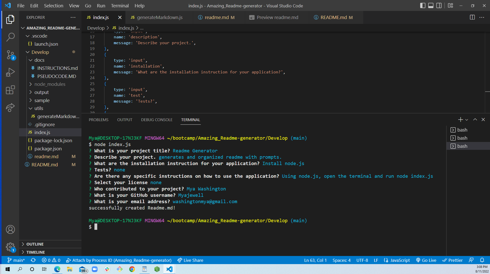
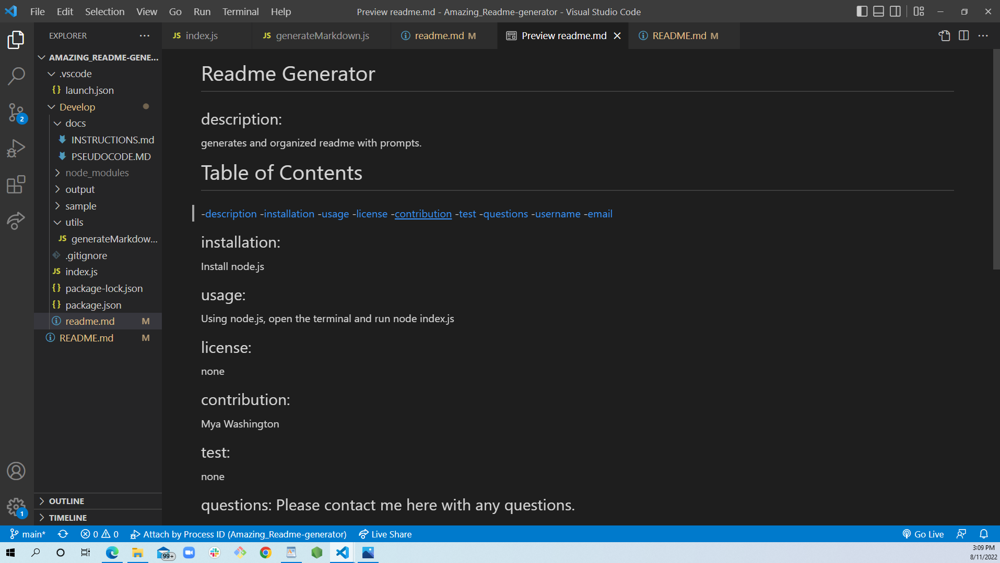

  # Amazing_Readme_Generator

  ## description:
  CLI readme generator that will make an organized readme that generated all requirements.

   # Table of Contents
  -[description](#description)
  -[screenshots](#screenshots)
  -[installation](#installation)
  -[usage](#usage)
  -[license](#license)
  -[contribution](#contribution)
  -[test](#test)
  -[questions](#questions)
  -[username](#username)
  -[email](#email)

  ## screenshots:
  
  
  
    
  ## installation: 
  Using the terminal and node.js
     
  ## usage: 
  install node.js and open the terminal, then run node index.js.
     
  ## license: 
  none
     
  ## contribution: 
  Mya Washington
      
  ## test:
  none

  ## questions: Please contact me here with any questions.

  ## username:
  (<a href="https://github.com/Myajewell/Amazing_Readme-generator" target="_blank">GitHub: Myajewell</a>)
     
  ## email: 
  washingtonmya@gmail.com

  ## Readme demonstration video
  (<a href="https://drive.google.com/file/d/1n6gWincYeYd2-vjHyn-RJ4EOUgJ7YT5I/view" target="_blank">README Video</a>)
